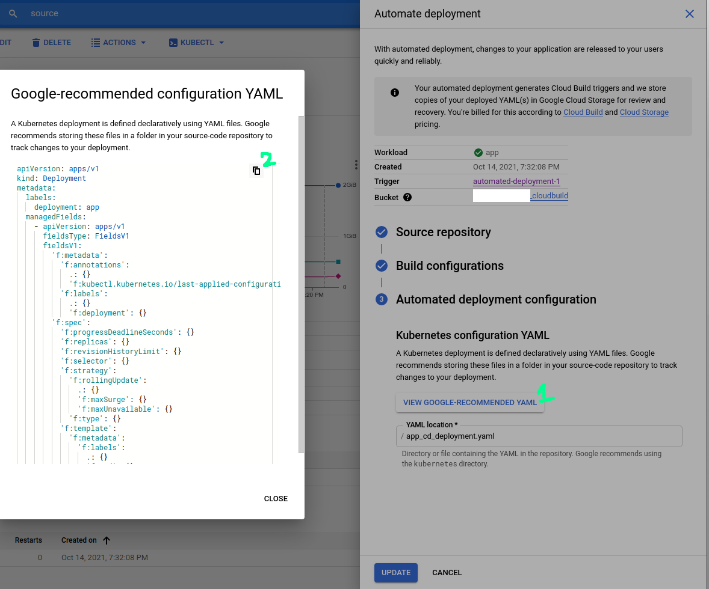

# cloudgeeks.ca

# docker-django-redis-celery-nginx-supervisor

Docker Nginx Django Redis Celery Supervisor

### Prerequisite  

  1. Access to https://console.cloud.google.com/ 
  2. Project is created with billing enabled.
  3. Cloudsdk setup on local machine or access to cloud shell on gcp console.


Clone this repository on either environment (local machine or cloud shell).  

Change working directory to root of this repo.  

Use ```gcloud init``` to configure gcloud environment. (For selecting __PROJECT_ID__ and __REGION/Zone__ refer to [__*Variables*__](#variables) section.)
# Deployemnt of Django Celery App  

## Major Components  

    1. GKE Cluster
    2. SQL database
    3. Secret Manager
    4. Cloud Build (Continous Deployment)

## Enable API's  

Enable the apis which will be used by project:
```
gcloud services enable \
 container.googleapis.com \
 sqladmin.googleapis.com \
 cloudbuild.googleapis.com \
 secretmanager.googleapis.com \
 sourcerepo.googleapis.com \
 servicenetworking.googleapis.com \
 compute.googleapis.com
```
## Variables  

```  
PROJECT_ID=gke-fatafat-mub
REGION=us-central1
ZONE=us-central1-c

# Service Account Name to be created and used by gke cluster, make sure it is unqiue within project
SA_NAME=fatafatgke
# Service Account complete name
SERVICE_ACCOUNT=fatafatgke@$PROJECT_ID.iam.gserviceaccount.com

# Database credentials 
DBPASS="$(cat /dev/urandom | LC_ALL=C tr -dc 'a-zA-Z0-9' | fold -w 30 | head -n 1)"
SQL_INSTANCE_ID=myinstance


CLUSTER_NAME=cluster-2
# Number of Nodes in the Cluster
NUM_OF_NODES=2
# REGION in which nodes will be created
COMPUTE_REGION=us-central1
# Incase to use single zone, replace --region $COMPUTE_REGION with --zone $COMPUTE_ZONE
COMPUTE_ZONE=us-central1-c

# Network 
NETWORK=projects/$PROJECT_ID/global/networks/default
# SubNet
SUB_NET=projects/$PROJECT/regions/$REGION/subnetworks/default


# Namespace to be used for deployments (creating pods, services inside cluster)
NAMESPACE=testing

# Image name to be pushed to gcr.io
IMAGE_NAME=testing


# cloud build service account
PROJECTNUM=$(gcloud projects describe ${PROJECT_ID} --format 'value(projectNumber)')
CLOUDBUILD=${PROJECTNUM}@cloudbuild.gserviceaccount.com
```  
## Create Custom Service Account for GKE and Add IAM Biniding/roles  

 For __SA_NAME__ and __SERVICE_ACCOUNT__ refer to [__*Variables*__](#variables) section.
create service account
```
gcloud iam service-accounts create $SA_NAME --display-name=$SA_NAME
```
  
Add required roles for managing GKE cluster.  
```
gcloud projects add-iam-policy-binding $PROJECT_ID \
  --member "serviceAccount:$SERVICE_ACCOUNT" \
  --role roles/logging.logWriter

gcloud projects add-iam-policy-binding $PROJECT_ID \
  --member "serviceAccount:$SERVICE_ACCOUNT" \
  --role roles/monitoring.metricWriter

gcloud projects add-iam-policy-binding $PROJECT_ID \
  --member "serviceAccount:$SERVICE_ACCOUNT" \
  --role roles/monitoring.viewer

gcloud projects add-iam-policy-binding $PROJECT_ID \
  --member "serviceAccount:$SERVICE_ACCOUNT" \
  --role roles/stackdriver.resourceMetadata.writer

# for accessing gcr.io images
gcloud projects add-iam-policy-binding $PROJECT_ID \
  --member "serviceAccount:$SERVICE_ACCOUNT" \
  --role roles/storage.objectViewer

# for accessing cloud databases
gcloud projects add-iam-policy-binding $PROJECT_ID \
  --member "serviceAccount:$SERVICE_ACCOUNT" \
  --role roles/cloudsql.client

# for accessing secrets
gcloud projects add-iam-policy-binding $PROJECT_ID \
  --member "serviceAccount:$SERVICE_ACCOUNT" \
  --role roles/secretmanager.secretAccessor
```
### Configure Private Services Access for CloudSQL private instance  
This is one time process for a project.  
For __PROJECT_ID__ refer to [__*Variables*__](#variables) section.  
```
# configure ip address allocation range
gcloud compute addresses create google-managed-services-default \
--global \
--purpose=VPC_PEERING \
--prefix-length=16 \
--network=default

# Creating a private connection from your VPC network (default) to the underlying service producer network
gcloud services vpc-peerings connect \
--service=servicenetworking.googleapis.com \
--ranges=google-managed-services-default \
--network=default \
--project=$PROJECT_ID
```

## Create Database  
For __SQL_INSTANCE_ID, PROJECT_ID, DBPASS__ refer to [__*Variables*__](#variables) 
```
gcloud beta sql instances create $SQL_INSTANCE_ID --no-assign-ip --project $PROJECT_ID --network=default --root-password=$DBPASS  --database-version  POSTGRES_13  --tier db-f1-micro --region $REGION
```
## Create Secret  
  *documentation details of this section is pending*
```
rm .env 2> /dev/null
source create_configurations.sh
gcloud secrets create application_settings --data-file=.env
```  
If above command gives error "Secret Already Exists", use:
```
gcloud secrets versions add  application_settings --data-file=.env
```
## Create GKE Cluster  

Execute the following command to create GKE cluster.  
For __PROJECT_ID, CLUSTER_NAME, COMPUTE_REGION, SERVICE_ACCOUNT, NUM_OF_NODES, NETWORK, SUB_NET (env variables)__ refer to [__*Variables*__](#variables) section.
```
gcloud beta container --project $PROJECT_ID clusters create $CLUSTER_NAME --region $COMPUTE_REGION --no-enable-basic-auth --cluster-version "1.20.10-gke.301" --release-channel "regular" --machine-type "e2-medium" --image-type "COS_CONTAINERD" --disk-type "pd-standard" --disk-size "100" --metadata disable-legacy-endpoints=true --service-account $SERVICE_ACCOUNT --max-pods-per-node "110" --num-nodes $NUM_OF_NODES --logging=SYSTEM,WORKLOAD --monitoring=SYSTEM --enable-ip-alias --network $NETWORK --subnetwork $SUB_NET --no-enable-intra-node-visibility --default-max-pods-per-node "110" --no-enable-master-authorized-networks --addons HorizontalPodAutoscaling,HttpLoadBalancing,GcePersistentDiskCsiDriver --enable-autoupgrade --enable-autorepair --max-surge-upgrade 1 --max-unavailable-upgrade 0 --enable-shielded-nodes
```

### Configure kubectl command line access  
For __CLUSTER_NAME__, __COMPUTE_REGION__ and __PROJECT_ID__ refer to [__*Variables*__](#variables) section.
```
gcloud container clusters get-credentials $CLUSTER_NAME --region $COMPUTE_REGION --project $PROJECT_ID
```

## Configure Namespace   
For __NAMESPACE__ refer to [__*Variables*__](#variables) section.  
```
kubectl create namespace $NAMESPACE
```
## Create Redis Deployment and Start Redis Service
For __NAMESPACE__ refer to [__*Variables*__](#variables) section. 

Create redis deployment (for details refer to file /redis-deployment.yaml in this repo).
```
kubectl apply -f redis-deployment.yaml --namespace=$NAMESPACE
```
To make sure deployment is successfull ``` kubectl get pods --namespace=$NAMESPACE ```  

Create redis-service (for details refer to file /redis-deployment.yaml in this repo).
```
kubectl apply -f redis-service.yaml --namespace=$NAMESPACE
```
## Configure CI/CD for django-celery App  

### Build and push image to gcr.io  

Build Image from Dockerfile in working directory and push to gcr.io
For __PROJECT_ID, IMAGE_NAME__ refer to [__*Variables*__](#variables) section.
```
TAG=gcr.io/$PROJECT_ID/$IMAGE_NAME
docker build --tag $TAG .
docker push $TAG
```
### Deploy to GKE  
For __PROJECT_NAME, IMAGE_NAME, NAMESPACE__ refer to [__*Variables*__](#variables) section.  
Go to app_deployment.yaml, to spec.template.spec.containers.image and change the value to gcr.io/YOUR_PROJECT_NAME/YOUR_IMAGE_NAME  
To get YOUR_PROJECT_NAME use ```echo $PROJECT_NAME``` and for YOUR_IMAGE_NAME use ```echo $IMAGE_NAME```
```
kubectl apply -f app_deployment.yaml --namespace $NAMESPACE
```

```
kubectl apply -f app_service.yaml --namespace $NAMESPACE
```
### Allow Cloud Build iam role to deploy to GKE cluster  
For __CLOUDBUILD__ refer to [__*Variables*__](#variables) section.  
```
# for creating deployments/services on gke cluster
gcloud projects add-iam-policy-binding $PROJECT_ID \
  --member "serviceAccount:$CLOUDBUILD" \
  --role roles/container.developer
```
### Configure Continous Deployment  
Now go to :
*replace PROJECT_ID with your project id (you can use echo $PROJECT_ID in terminal to get your project id).*  
https://console.cloud.google.com/kubernetes/workload/overview?project=PROJECT_ID  

For __NAMESPACE__  and __CLUSTER_NAME__ refer to [__*Variables*__](#variables).  
Now select the Deployemnt where Name=app and Type=Deployment and Namespace=NAMESPACE and Cluster=CLUSTER_NAME
  
  


Now in Deployment details Select Actions -> Then Select Automated Deployment  
  
  


Now in Automate Deployment -> In 1. Source Repository, set "Repository Providor" to Github, authenticate and link Github repo and then select repo.   
Then press continue.  
  
  
  

Now in Automate Deployment -> In 2. Build Configurations, set "Branch" to branch on which you want to add trigger, and set other fields accordingly and press contiue.  
  
  
  

Now in Automate Deployment -> In 3. Automated deployment configuration, set "YAML location" location and name accordingly.  
Then click in "VIEW GOOGLE-RECOMMENDED YAML" -> Then copy the configurations text and save then on local machine in same file (create if needed) as mentioned in "YAML location"  
   
  


Then press "SET UP"  

Now on new commit in the mentioned branch will trigger the build and New Image will be created and new Deployment will be created.  